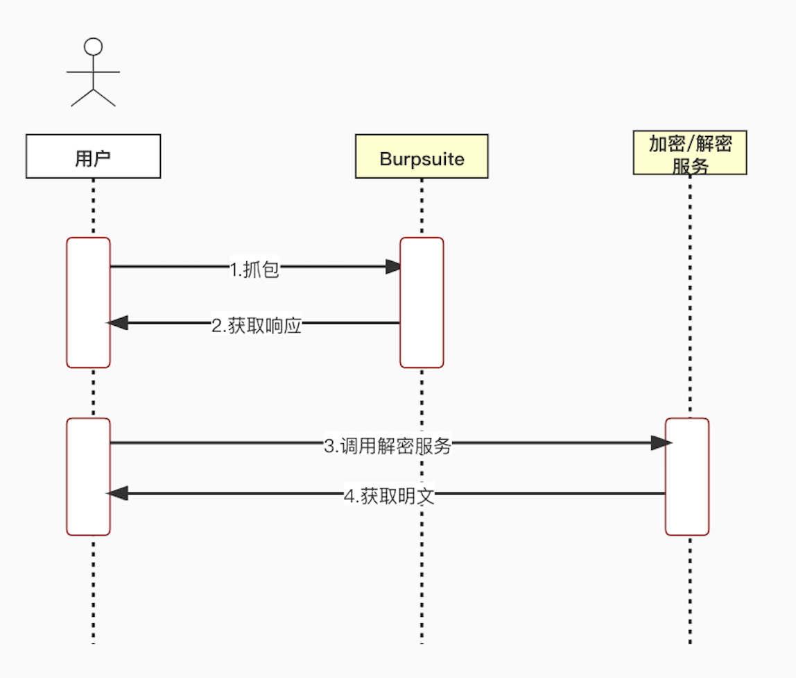
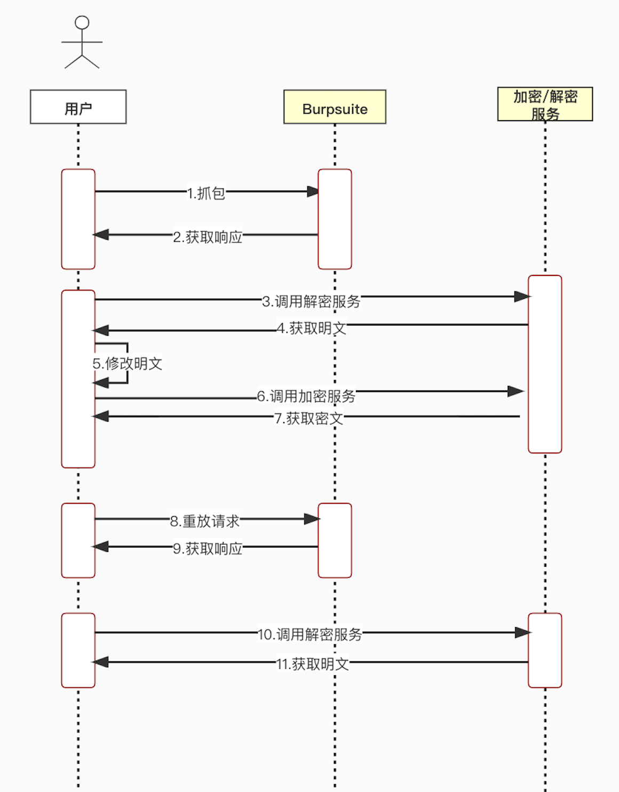
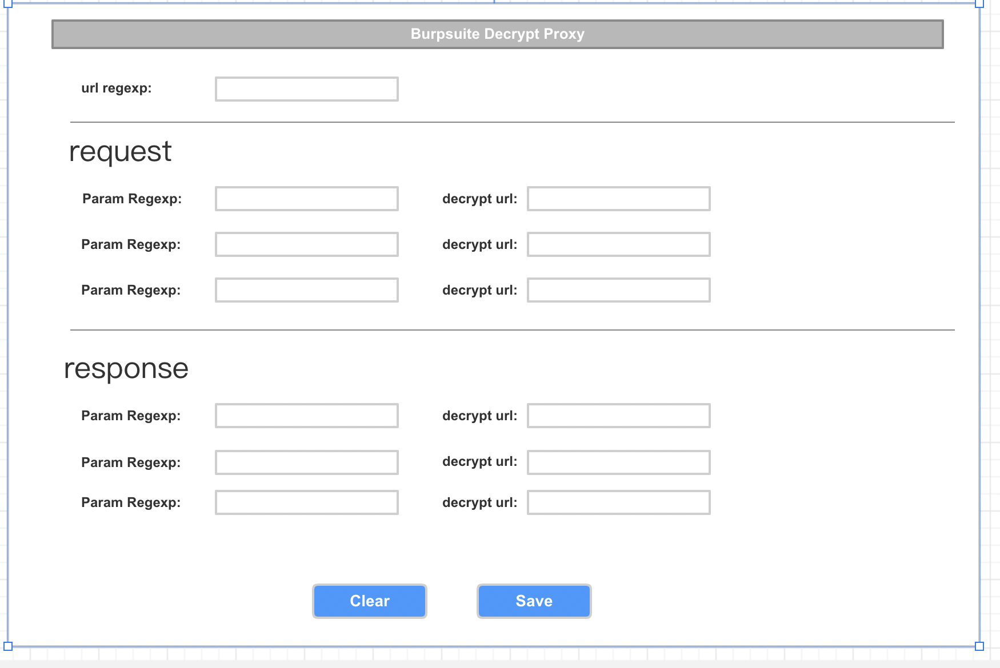
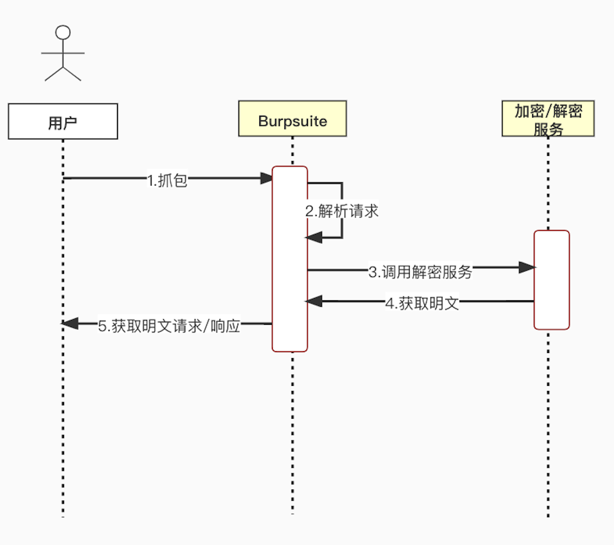
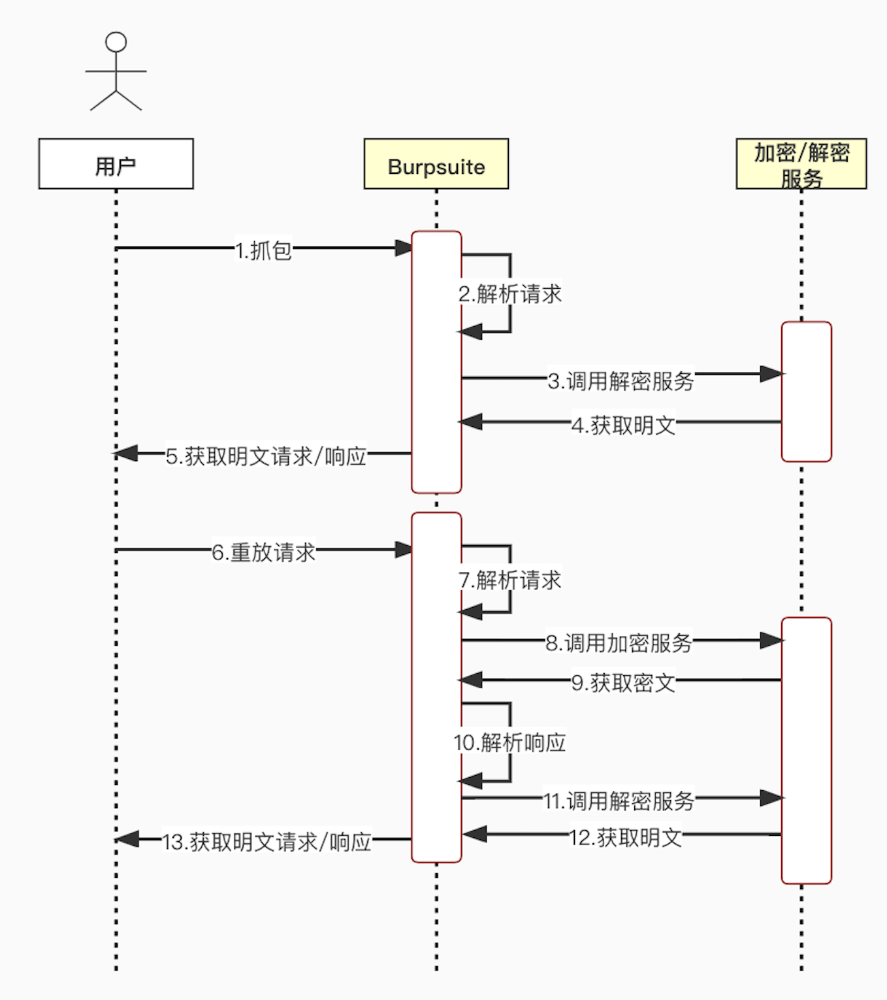

# BurpProxy 插件
## 背景
在平常的工作学习中，抓包是家常便饭，抓包发现有请求加密更是家常便饭。我现在的方式是从抓包工具中复制出加密的文本，然后再调用自己写的解密工具/服务来观察解密后的内容。如果要修改请求就会更麻烦一些，首先复制出来，调用本地的解密服务/工具，得到明文后，修改明文再调用加密的服务/工具得到密文后复制到抓包工具重放

### 时序图
现有模式的解密时序图

现有模式的重放时序图

可以看到这两种常见场景，人工参与的过程很多

## 目标
1. 自动化处理请求的加密解密
2. 减少以上场景人工参与的过程
   
## 设计方案
### 说明
本插件本身不支持加密/解密，加密/解密的服务需要使用者自己搭建

插件调用加密/解密服务只支持POST请求， Content-Type: application/json

目前只支持最多request/response各3个参数的配置

### 界面
#### TAB页

### 时序图
使用插件后的解密时序图

使用插件后的重放时序图

### 开发
IDEA CE + JFormDesigner + jdk1.8

## 参考
[从头开发一个BurpSuite数据收集插件](https://www.secpulse.com/archives/124593.html)

[HaE - Highlighter and Extractor](https://github.com/gh0stkey/HaE)

[BurpSuite API](https://portswigger.net/burp/extender/api/index.html)

[BurpSuite Demo](https://portswigger.net/burp/extender/)